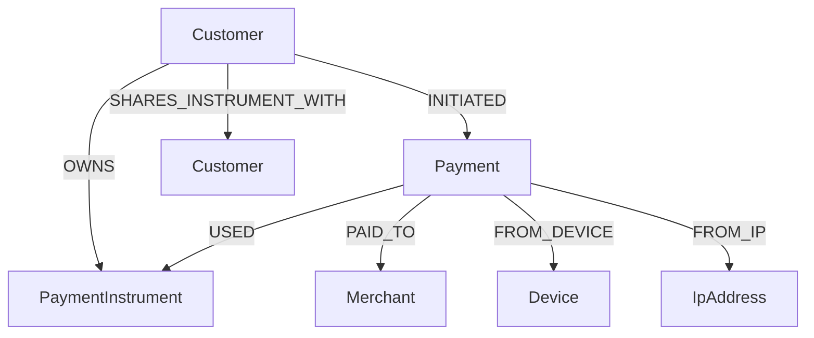

# Neo4j sample data - Payment Processing PoC

Esta carpeta contiene datos de prueba para poblar Neo4j con un caso de uso de **payment processing**.

## Modelo de grafo



## Archivos

```text
neo4j-sample-data/
├── cypher/
│   ├── 001-clean-db.cypher
│   ├── 002-constraints-and-indexes.cypher
│   ├── 003-master-data.cypher
│   ├── 004-payments.cypher
│   ├── 005-risk-scenarios.cypher
│   └── 006-demo-queries.cypher
└── scripts/
    ├── load-data.sh
    └── load-data.ps1
```

## Cómo usarlo con el proyecto

Copia la carpeta dentro de:

```text
infraestructura/neo4j/sample-data
```

Luego edita `infraestructura/docker-compose.yml` y agrega este volumen al servicio `neo4j`:

```yaml
volumes:
  - neo4j_data:/data
  - neo4j_logs:/logs
  - ./neo4j/init.cypher:/var/lib/neo4j/import/init.cypher:ro
  - ./neo4j/sample-data:/var/lib/neo4j/import/sample-data:ro
```

Levanta Neo4j:

```bash
cd infraestructura
docker compose up -d neo4j
```

Carga los datos en Linux/Mac/Git Bash:

```bash
./neo4j/sample-data/scripts/load-data.sh
```

Carga los datos en PowerShell:

```powershell
./neo4j/sample-data/scripts/load-data.ps1
```

## Credenciales de Neo4j

```text
URL: http://localhost:7474
User: neo4j
Password: paymentspoc123
```

## Consultas demo

Abre Neo4j Browser y ejecuta las consultas del archivo:

```text
cypher/006-demo-queries.cypher
```

Consulta rápida para ver pagos con riesgo:

```cypher
MATCH path = (c:Customer)-[:INITIATED]->(p:Payment)-[:PAID_TO|USED|FROM_DEVICE|FROM_IP]->(n)
WHERE p.status IN ['REVIEW','DECLINED']
RETURN path;
```
